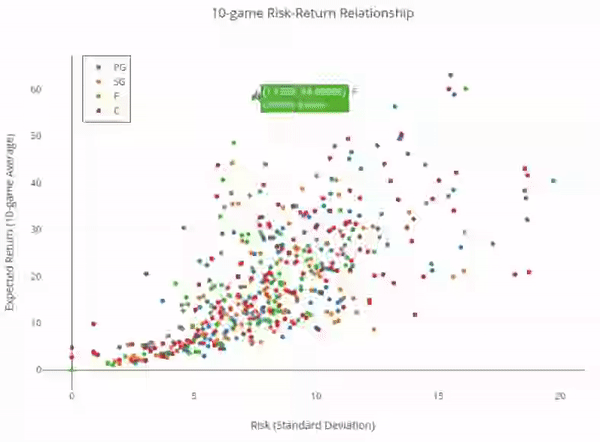
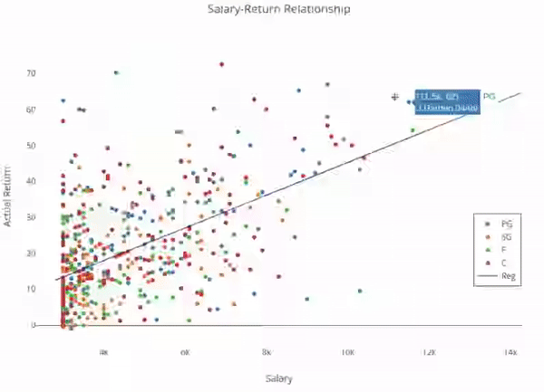
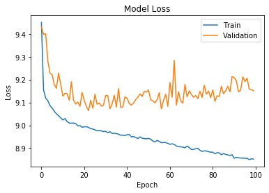
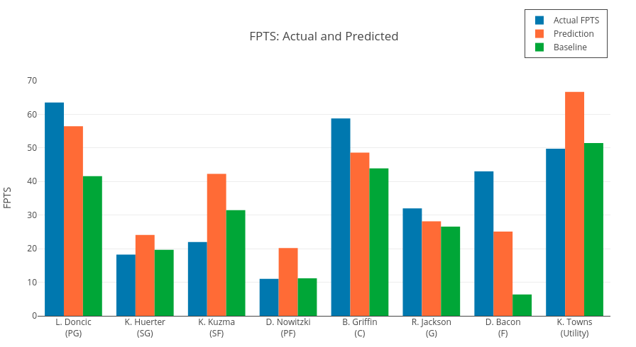

## NBA Player Performance Prediction and Lineup Optimization

Prediction of NBA player performance defined as Fantasy Points by Draft Kings. This capstone project was conducted and approved by a reviewer as part of Machine Learning Engineer Nanodegree by Udacity. See the final report [here](https://github.com/sc30ash/NBA-predictions/blob/main/report.pdf) for details.

Note that the code was updated since the writing of the report and the content does not necessarily match up. This project is under minor refactoring and documentation as of Jun 2019, feel free to reach out to me via email at bhardwaj.p.ashmit@gmail.com.

### What We'll Do

The end goal of this project is to generate a series of lineups for a fantasy basketball website [DraftKings](https://www.draftkings.com/). To achieve that, we'll scrape player statististics from each regular season game starting in the 2014-15 season as well as past fantasy salary information. First, we'll build a predictive model for player performance, and then we will use genetic algorithm to construct fantasy lineups to maximize the total fantasy points while satisfying the salary constraint.

### What We Won't Do

Given the complexity of the series structure and difference in nature, we won't be considering playoff games. In addition, a major factor omitted from our analysis is the opponent's defensive ability as a team or at a givne position (for instance, Paul George is excellent at stealing the ball), which arguably is one of the most important factors of the game. Tackling this aspect will be an easy improvement to this project.

### Requirements

Along with libraries specified in [requirements.txt](requirements.txt), you need to sign up with Plotly for free to create interactive visualizations.

### Understanding Fantasy Sports

The key to select a good fantasy lineup is to identify players that are consistent performers. This basic intuition comes from Harry Morkowitz's [Modern Portfolio Theory (MPT)](https://www.investopedia.com/terms/m/modernportfoliotheory.asp), and the following scatter plot looks at the relationship between risk and return, where return is the average fantasy points over a given range of games (in this case, past 10 games) and risk is its standard deviation. For a given level of risk (x-axis), a player with a better return is considered to be superior. The plot is based on the late 2018-19 season statistics, where, for instance, Lebron James is shown in the top-left with a 10-game average of a whopping 58.1 fantasy points and a 7.4 standard deviation. The top curve starting from Harden (top right), Lebron, Paul George, Gorbert, Sexton, and Zubac can be considered as [Efficient Frontier](https://www.investopedia.com/terms/e/efficientfrontier.asp) in the framework of the MPT. In general, players on the outer left of the cluster are considered as good assets with low risk and high return. Players are color-coded based on rough positions of PG, SG, F (SF, PF, SF/PF), and C (PF/C, C). A fully interactive version can be accessed [here](https://plot.ly/~KengoA/12/_10-game-risk-return-relationship/#/).

Another important dimension of the game of fantasy basketball is player salary. Fantasy sports websites like DraftKings determine player salary values given their previous performance and roster information in a semi-automatic fashion, such that it is more costly to include "stud" players with high expected return (LeBron, Westbrook, Harden) into your lineup. DraftKings has a salary cap of $50,000 for a selection of 8 players, giving each player an average salary of $6250. The graph below shows a scatterplot of a player's salary and his actual performance of the day in the latest games of the 2018-19 season. One striking insight is that while it is easy to identify studs like Westbrook who had a total fantasy poitns of 61.5 for his 11.8k salary April 10, "value" players who exceed expectations are much more difficult to find, with a large variance given a salary level. For instance, Jamal Crawford on the top left had monstrous performance for a combined fantasy points of 70.25, despite the low expectation of his \$4300 salary. These "value" players are what differentiates winning lineups from those of a typical beginner with a collection of star players and underachieving benchwarmers. This requires deeper insight into who will outperform their expectations. For instance, an injury of a starting player most likely increases minutes for other starting members and the second option player on the bench. A fully interactive version can be accessed [here](https://plot.ly/~KengoA/14/salary-return-relationship/#/).

### Project Structure

This project consists of 9 Jupyter notebooks and functionalities are described below, where the second half consists of construcing machine leanring models and making inference, and optimising lineups for DraftKings.

- [01.data_scraping.ipynb](src/01.data_scraping.ipynb) scrapes games data from Basketball-Reference.com and salary and position information from RotoGuru.

- [02.merging_data.ipynb](src/02.preprocessing.ipynb) merges the two datasets with name standardisation and preliminary preprocessing of data such as calculation of FPTS based on the key statistics.

- [03.exploratory_analysis.ipynb](src/03.exploratory_analysis.ipynb) visually explores relationships between; salary and actual FPTS and; expected FPTS and standard deviation of the past 10 games.

- [04.feature_engineering.ipynb](src/04.feature_engineering.ipynb) constructs the baseline model with simple average along with additional three datasets with weighted average, where several features are engineered and incorporated.

- [05.baseline_models.ipynb](src/05.baseline_models.ipynb) sets up the baseline model with simple season average adopted by DraftKings and linear regression with feature selection models. For notebooks 06-08, we use 5-fold cross validation to approximate model errors.

- [06.lightgbm_bayesian_optimization.ipynb](src/06.lightgbm_bayesian_optimization.ipynb) uses bayesian optimisation method to find the best parameters for a boosting model using lightGBM. Parameters and their results are saved in a text file.

- [07.neural_networks.ipynb](src/07.neural_networks.ipynb) constructs three neural network models using keras, and saves model weights only when there was an improvement. While deep learning models might not suit this dataset of limited size, it shows improvement compared to boosting models.

  

- [08.predictions.ipynb](src/08.predictions.ipynb) trains on the whole dataset except for the month of March 2019, where each contest's cashline for double up was manually obtained from RotoGrinders. Inference is made on this test data from March 2019.

- [09.lightgbm_bayesian_optimization.ipynb](src/06.lightgbm_bayesian_optimization.ipynb) uses Genetic Algorithms to select best combinations of players on a given set of games ans predictions. Performance of the lineups chosen by the algorithm against other DraftKings users is examined for contests held in March, 2019. Note that the contest data is manually obtained from Rotogrindrs' ResultsDB page without scraping. Predictions from the baseline model and final model are compared to the actual performance. The following figure shows the optimal lineup this model returns, with differences between the actual FPTS and predicted FPTS with neural network and baseline models.

  

Main procedures are coded and explained in markdown using Jupyter Notebook. Although not requred, jupyter nbextentions are highly recommended for convenience and visibility (see link). Useful extensions are Codefolding, ExecuteTime, Collapsible Headings, and Variable Inspector. http://jupyter-contrib-nbextensions.readthedocs.io/en/latest/install.html
